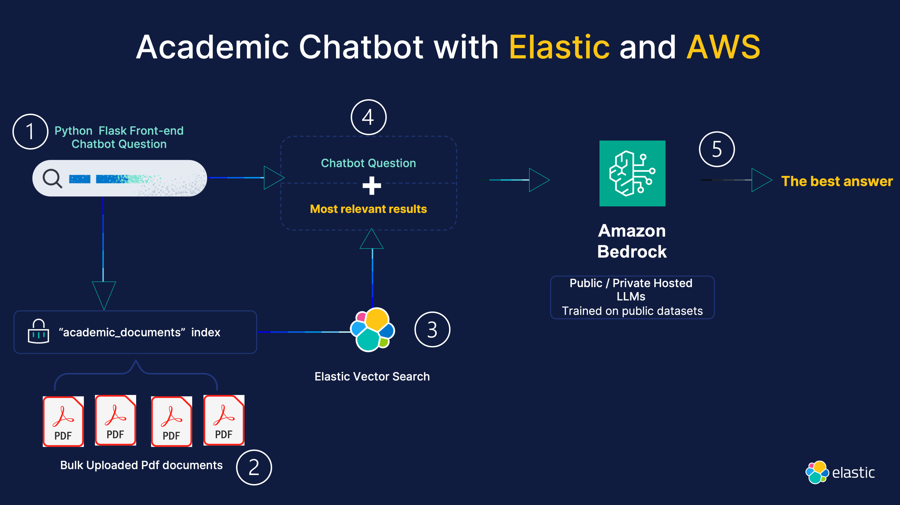

# Academic Q&A Chatbot

A Flask-based academic Q&A chatbot that integrates Elasticsearch and Amazon Bedrock with Claude to provide accurate answers from academic documents.

## Features

- **Vector Search**: Retrieves the top 3 most relevant academic documents for each query using ELSER sparse embeddings
- **AI-Powered Answers**: Generates concise, contextual responses using Claude through Amazon Bedrock
- **Source Citations**: Includes citations to specific source documents
- **Interactive UI**: Clean interface with collapsible source sections and async request handling

## Architecture



This diagram illustrates the architecture of an academic question-answering system that combines Elasticsearch for document retrieval and Amazon Bedrock for generating accurate answers.

1. **User Interface**: A Python Flask front-end provides the interface where users enter their academic questions (shown on the left with a search box).

2. **Document Repository**: The system has bulk-uploaded PDF documents containing academic information (employee handbooks, class registration procedures, university information, career counseling resources, etc.) which are indexed in an Elasticsearch "academic_documents" index.

3. **Search Process**: 
   - When a user submits a question, it's sent to Elasticsearch's Vector Search functionality
   - Elasticsearch retrieves the most relevant results from the academic documents
   - The system combines the user's question with the most relevant document excerpts

4. **Answer Generation**: 
   - The combined information is sent to Amazon Bedrock (Amazon's AI service)
   - Amazon Bedrock processes the question and reference materials using Language Models (LLMs) trained on public datasets
   - The service can be deployed either in public or private hosted environments

5. **Response Delivery**: The system returns "The best answer" to the user, which is contextually accurate based on the academic documents

  # Key Components:

  - **Elasticsearch**: Handles document storage and vector search capabilities for semantic matching
  - **Amazon Bedrock**: Provides the AI inference capabilities to generate natural language responses
  - **Flask**: Powers the front-end web interface for user interaction
  - **Vector Search**: Enables semantic understanding of queries rather than just keyword matching

  This architecture enables an academic chatbot that can accurately answer questions by leveraging both the information retrieval capabilities of Elasticsearch and the natural language generation abilities of large language models through Amazon Bedrock.

## Project Structure 
- `app.py`: Flask web application
- `search.py`: Elasticsearch integration for academic document search
- `bedrock_claude.py`: Amazon Bedrock client for Claude integration
- `templates/`: HTML templates for the web interface
- `inputs/`: PDF files that are bulk loaded into Elastic
- `bulk_load_data_into_elastic.py`: Python script to bulk upload pdf files to Elastic

## Requirements

- Python 3.8+
- Flask
- Elasticsearch Python client
- AWS SDK for Python (boto3)
- An Elasticsearch instance with academic_documents index with ELSER
- Amazon Bedrock access with permissions to use Claude models

## Setup Instructions

1. **Clone the repository**:
   ```bash
   git clone --depth 1 --no-checkout https://github.com/aws-samples/aws-generativeai-partner-samples.git
   cd aws-generativeai-partner-samples/
   git sparse-checkout set elastic
   git checkout

   cd elastic/solutions/acamedic-rag-app
   ```

2. **Install dependencies**:
   ```bash
   pip install -r requirements.txt
   ```

3. **Set up environment variables**:<br>
Copy .env.example & save as .env: `cp .env.example .env` (then edit with your credentials)
   ```bash
   cp .env.example .env
   ```
   Edit `.env` with your Elasticsearch and AWS credentials.
    #### Environment Configuration
    The following environment variables need to be configured:
   - `ELASTIC_CLOUD_ID`: Your Elasticsearch Cloud ID
   - `ELASTIC_API_KEY`: Your Elasticsearch API key
   - `USE_ELASTIC_CLOUD`: Set to "true" for cloud or "false" for local Elasticsearch
   - `ELASTIC_INDEX`: academic_documents
   - `AWS_REGION`: AWS region (e.g., us-east-1)
   - `AWS_ACCESS_KEY_ID`: Your AWS access key
   - `AWS_SECRET_ACCESS_KEY`: Your AWS secret access key
   - `CLAUDE_MODEL_ID`: Claude model ID (default: anthropic.claude-3-7-sonnet-20250219-v1:0)


4. **Run the bulk uploader**:
   ```
   python bulk_load_into_elastic.py
   ```

5. **Run the application**:
   ```bash
   python app.py
   ```
   The application will be available at `http://localhost:5000`

## API Usage

The chatbot provides a simple API endpoint:

```
POST /api/ask
Content-Type: application/json

{
  "question": "What are the recent advances in RAG?"
}
```

Response:
```json
{
  "answer": "Claude's response...",
  "sources": [
    {
      "id": "doc123",
      "title": "Document Title",
      "content": "Document content...",
      "score": 0.87,
      "created_on": "2023-09-15T14:30:00Z",
      "updated_at": "2023-10-20T09:45:00Z"
    },
    ...
  ]
}
```